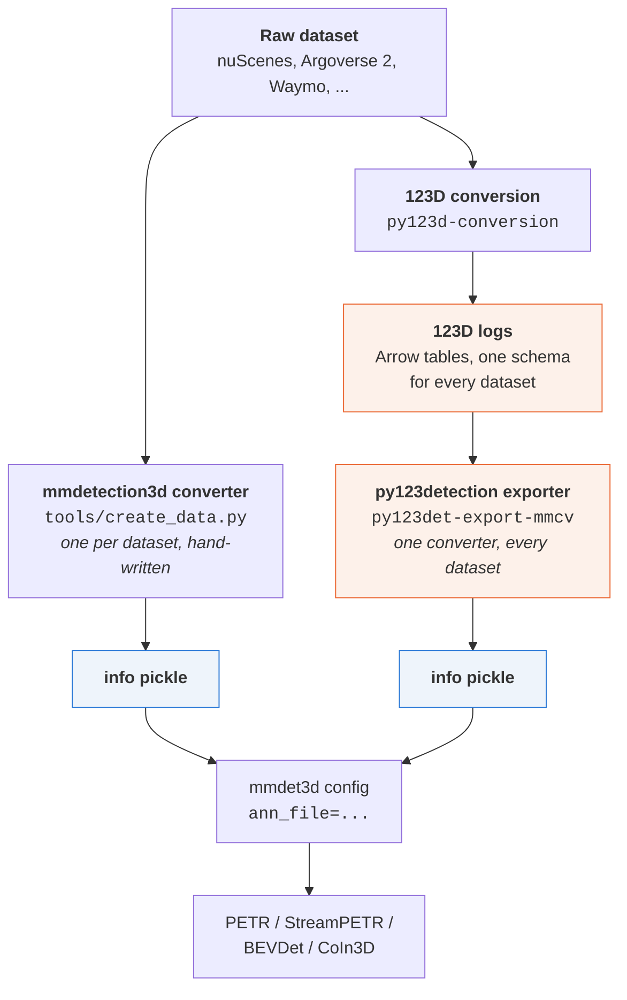

# py123detection

A 123D toolkit for 3D multi-view object detection.

Two branches share the 123D data model:

| Branch | Module | Status |
| --- | --- | --- |
| **mmcv export**: turn any 123D dataset into the `info` pickle the mmcv / mmdetection3d ecosystem reads, so existing PETR / StreamPETR / BEVDet configs train on 123D data unchanged | `py123detection.mmcv_export`, plus `py123detection.mmcv_plugin` on the training side | implemented |
| **modern stack**: the mmcv-free path from the master thesis | | not started |

123D already normalizes a dozen driving datasets into one schema. mmdetection3d natively supports exactly one data format: the nuScenes `info` pickle. Every camera-based detector built on it (PETR,
StreamPETR, BEVDet, CoIn3D) reads that specific data format, and for example CoIn3D's cross-dataset training works by converting Waymo and Lyft into it and concatenating the results.

One converter from 123D to that exact data format makes every 123D dataset trainable with off-the-shelf
configs, individually or mixed.



The two pickles are interchangeable. That claim is measured, not asserted: see
[Does the output match the native converter?](docs/validation.md#does-the-output-match-the-native-converter).

## Install

```bash
pip install -e py123detection
pip install -e "py123detection[nuscenes]"   # restore native nuScenes sample tokens
pip install -e "py123detection[images]"     # re-encode images when extracting MP4-backed logs
```

The exporter needs py123d and numpy, not mmcv, mmdet3d or torch.

## Quick start

```bash
export PY123D_DATA_ROOT=/data/py123d
py123det-export-mmcv export --split nuscenes-mini_train --out /data/nuscenes/py123d_infos_train.pkl
```

```python
from py123detection import Source
from py123detection.mmcv_export import export_to_mmdet3d

report = export_to_mmdet3d(
    Source(data_root="/data/py123d", splits=["nuscenes-mini_train"], sample_rate_hz=2.0),
    output_path="/data/nuscenes/py123d_infos_train.pkl",
)
print(report.summary())
```

The pickle is the nuScenes info schema, so an existing config only needs `ann_file` pointed at it.
[Quick start](docs/quickstart.md) shows the expected output and the config snippet.

## Documentation

Build the site with `pip install -e "py123detection[docs]"` and
`sphinx-build -b html docs docs/_build/html`. The Markdown pages also read fine on GitHub:

- [Install](docs/installation.md) and [Quick start](docs/quickstart.md)
- Guides: [choosing what to export](docs/guides/choosing-what-to-export.md),
  [static vs. dynamic extrinsics](docs/guides/extrinsics.md),
  [images and point clouds](docs/guides/sensor-payloads.md),
  [cross-dataset training](docs/guides/cross-dataset-training.md),
  [frame identifiers and nuScenes evaluation](docs/guides/tokens-and-evaluation.md),
  [crossing the Python version boundary](docs/guides/python-version-boundary.md),
  [other datasets](docs/other-datasets.md)
- [Validation](docs/validation.md): the native-converter comparison and known differences
- [Development](docs/development.md): layout, tests, building the docs
- CLI and API reference: generated, built site only

## Tests

```bash
pytest                                  # 179 unit tests, no data needed
NUSCENES_DATA_ROOT=... PY123D_DATA_ROOT=... pytest -m integration    # the round-trip comparison
```
