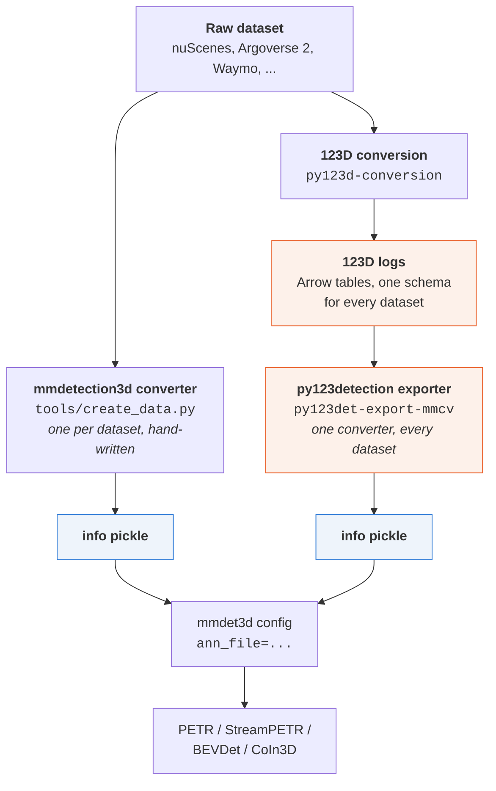
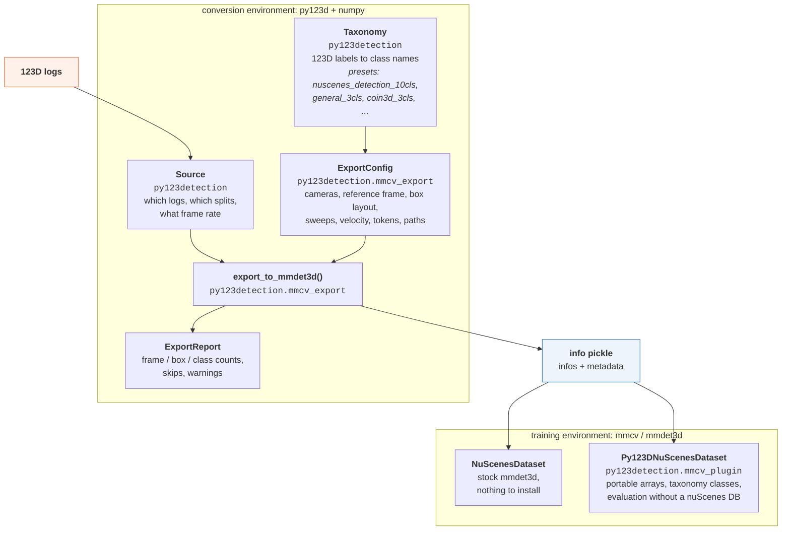

# py123detection

A [123D](https://kesai.eu/py123d/) toolkit for 3D multi-view object detection.

Two branches share the 123D data model:

| Branch | Module | Status |
| --- | --- | --- |
| **mmcv export**: turn any 123D dataset into the `info` pickle the mmcv / mmdetection3d ecosystem reads, so existing PETR / StreamPETR / BEVDet configs train on 123D data unchanged | `py123detection.mmcv_export`, plus `py123detection.mmcv_plugin` on the training side | implemented |
| **modern stack**: the mmcv-free path from the master thesis | | not started |

## Why this exists

123D already normalizes a dozen driving datasets into one schema. mmdetection3d natively supports exactly one data format: the nuScenes `info` pickle. Every camera-based detector built on it (PETR,
StreamPETR, BEVDet, CoIn3D) reads that specific data format, and for example CoIn3D's cross-dataset training works by converting Waymo and Lyft into it and concatenating the results.

One converter from 123D to that exact data format makes every 123D dataset trainable with off-the-shelf
configs, individually or mixed.

## How it fits together

There are two routes from a raw dataset to the pickle a detector trains on. The first needs a
hand-written converter for every dataset. The second needs none, because the per-dataset work
already happened when 123D was built.



The two pickles are interchangeable. That claim is measured, not asserted: see
[Does the output match the native converter?](validation.md#does-the-output-match-the-native-converter).

Inside the 123D route, these are the pieces you actually name in your own code or on the command
line. Everything else is internal.



The CLI is the same three objects behind a flag parser: `py123det-export-mmcv export` builds a
`Source` and an `ExportConfig` from its arguments and calls `export_to_mmdet3d`.

```{toctree}
:hidden:
:caption: Getting started

installation
quickstart
examples
```

```{toctree}
:hidden:
:caption: Guides

guides/choosing-what-to-export
guides/extrinsics
guides/sensor-payloads
guides/cross-dataset-training
guides/tokens-and-evaluation
guides/python-version-boundary
other-datasets
```

```{toctree}
:hidden:
:caption: Reference

validation
cli
api/index
```

```{toctree}
:hidden:
:caption: Development

contributing
development
```
